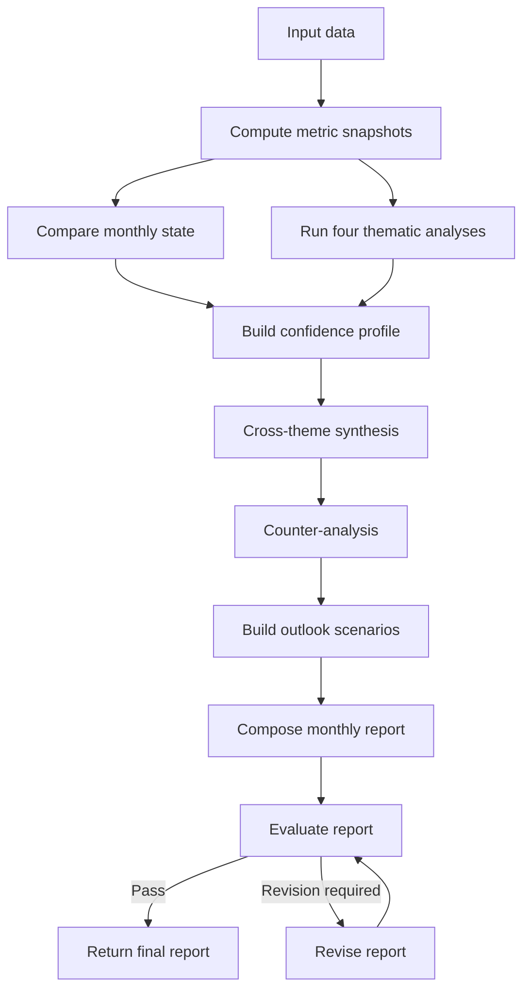

# AI UK Macro Reporting

A LangGraph-based pipeline for producing structured monthly UK macroeconomic reports from user-supplied indicator data. The project combines deterministic metric calculation with LLM-assisted thematic analysis, cross-theme synthesis, scenario construction, quality evaluation, and a bounded revision loop.

> **Project status:** Research and portfolio project. The generated reports require human review before publication or decision-making.

## Overview

The pipeline turns monthly economic observations into a structured report covering:

- output and demand;
- inflation and inflation expectations;
- labour-market conditions;
- monetary and financial conditions;
- cross-theme relationships and macro-regime classification;
- counter-analysis and alternative interpretations;
- central, upside, and downside scenarios;
- confidence, risks, qualifications, and indicators to watch.

Deterministic calculations establish the numerical evidence. Structured
thematic and synthesis nodes produce classifications that downstream
composition and revision must preserve. LLM nodes interpret and present that evidence, but they are not allowed to overwrite the upstream classifications. Pydantic schemas, consistency checks, truncation detection, public-prose validation, and report evaluation provide additional safeguards.

## Workflow



The evaluation loop stops when the report reaches the configured passing conditions or the maximum number of revision iterations is reached.

## Main capabilities

### Deterministic metric layer

The calculation layer:

- transforms indicator levels using percentage changes or absolute differences;
- preserves the appropriate unit, including percent, percentage points, and GBP millions;
- applies direction multipliers where the economic interpretation requires sign reversal;
- calculates recent change, momentum, volatility, direction, strength, and breadth;
- compares current and previous metric snapshots;
- builds a confidence profile by mapping the four LLM-produced thematic confidence
  classifications to fixed scores and averaging them equally.

Indicator groupings and transformation rules are defined in `calculation/metric_definitions.py`.
See [Understanding the report metrics](docs/metrics.md) for an intuitive guide to signals, direction, breadth, magnitude, persistence, and consistency.

### Structured LLM analysis

The LangGraph workflow uses separate model roles for:

| Role | Responsibilities |
|---|---|
| Analysis | Thematic reports, confidence explanation, and public-prose cleanup |
| Synthesis | Cross-theme analysis, counter-analysis, scenarios, and final composition |
| Editorial | Report evaluation and revision |

Every LLM report is validated against a Pydantic schema before it enters the graph state.

### Quality controls

The final report process includes:

- authoritative metadata restoration after composition and revision;
- deterministic checks for truncated prose;
- one constrained regeneration attempt for truncated output;
- detection and cleanup of internal methodological terminology in public prose;
- classification-fidelity and evidence-consistency checks;
- a 14-dimension report evaluation;
- a maximum of two report revisions by default.

## Final report structure

The generated report contains:

1. Executive summary
2. Current thematic conditions
3. Cross-theme assessment
4. Risks to the central interpretation
5. Conditional outlook with central, upside, and downside scenarios
6. Indicators and developments to watch
7. Overall assessment and uncertainty statement

The graph state also retains intermediate calculations, thematic reports, the confidence profile, the evaluation result, and the number of revisions.

## Data requirements

This repository does **not** include an economic dataset or a data-ingestion
pipeline. Supply observations as CSV or JSON using the three-column public
contract: `date`, `value`, and `full_name`. Indicator names must match the
definitions in `calculation/metric_definitions.py`.

Users are responsible for sourcing data lawfully, checking licences and terms
of use, and validating every observation.

## Input data

The application accepts monthly indicator observations supplied as CSV or
JSON-compatible records.

See:

- [Input data specification](docs/input-data.md)
- [Supported indicators and calculations](docs/indicators.md)
- [Format-only CSV template](examples/input-format-template.csv)

`examples/input-format-template.csv` demonstrates the required columns and
format only. Its four indicators and two observations per indicator are not
sufficient to produce a representative economic report.

## Requirements

- Python 3.13 or later
- [uv](https://docs.astral.sh/uv/)
- An OpenAI API key with access to the configured models

## Installation

From the repository root:

```bash
uv sync --frozen
```

Copy the example environment file and add your API key:

```bash
cp .env.example .env
```

The `.gitignore` excludes `.env` files. Never commit API keys or database credentials.

## Model configuration

The project provides role-based model defaults that can be overridden through environment variables:

| Environment variable | Default |
|---|---|
| `MONTHLY_REPORT_ANALYSIS_MODEL` | `gpt-5.6-luna` |
| `MONTHLY_REPORT_ANALYSIS_REASONING_EFFORT` | `medium` |
| `MONTHLY_REPORT_ANALYSIS_MAX_COMPLETION_TOKENS` | `16000` |
| `MONTHLY_REPORT_SYNTHESIS_MODEL` | `gpt-5.6-terra` |
| `MONTHLY_REPORT_SYNTHESIS_REASONING_EFFORT` | `medium` |
| `MONTHLY_REPORT_SYNTHESIS_MAX_COMPLETION_TOKENS` | `16000` |
| `MONTHLY_REPORT_EDITORIAL_MODEL` | `gpt-5.6-terra` |
| `MONTHLY_REPORT_EDITORIAL_REASONING_EFFORT` | `high` |
| `MONTHLY_REPORT_EDITORIAL_MAX_COMPLETION_TOKENS` | `16000` |

Model availability, supported parameters, latency, and cost can change. Review the configuration before running the full graph.

## Running the report

After configuring the API key, generate a report from CSV or JSON input. JSON
and HTML are produced by default:

```bash
uv run uk-macro-report --input /path/to/monthly-data.csv
```
The example CSV demonstrates the required input format only. It contains insufficient coverage and history for a meaningful economic report.

Choose the output directory, base filename, and formats as needed:

```bash
uv run --extra pdf uk-macro-report \
  --input data/input_data_YYYYDD.csv \
  --reporting-period YYYY-MM-DD \
  --output-directory reports \
  --name uk-macro-YYYY-MM \
  --format json html pdf
```

`--reporting-period` accepts a `YYYY-MM-DD` as-of date. If omitted, the report
uses the current UTC date.

Running the complete graph makes multiple model calls. Check the configured models and token limits before execution.

## Testing

The test suite covers metric transformation, breadth and signal classification, snapshot comparison, graph topology, deterministic nodes, thematic and synthesis nodes, report composition, evaluation, revision, schema serialization, prose cleanup, and truncation handling.

The LLM calls are mocked in the tests, so the suite does not make network calls
or require a real API key:

```bash
uv run pytest -q
```

Run the same checks used by continuous integration before opening a pull
request:

```bash
uv run ruff check .
uv run ruff format --check .
uv run pytest -q
```

## Project structure

```text
ai-uk-macro-reporting/
├── .github/workflows/ci.yml
├── examples/input-format-template.csv
├── main.py
├── pyproject.toml
├── uv.lock
├── src/
│   └── ai_uk_macro_reporting/
│       ├── calculation/      # Metric definitions, calculation, and comparison
│       ├── nodes/            # LangGraph node implementations
│       ├── presentation/     # HTML and PDF rendering and templates
│       ├── prompts/          # Role-specific prompt templates
│       ├── schemas/          # Pydantic structured-output schemas
│       ├── validation/       # Truncation and prose-leakage checks
│       ├── cli.py            # Input validation and command-line interface
│       ├── common.py         # Shared enums and configuration
│       ├── graph.py          # LangGraph construction and routing
│       ├── report_context.py # Shared metadata, evidence, and prompt inputs
│       ├── report_safeguards.py # Report cleanup and consistency checks
│       ├── state.py          # Monthly report graph state
│       └── tools.py          # Model configuration and invocation handling
└── tests/
```

`main.py` remains as a convenience wrapper for running the source checkout;
the installed command is `uk-macro-report`.

## Design principles

- **Deterministic evidence first:** numerical transformations and classifications are calculated before narrative generation.
- **Structured outputs:** Pydantic models constrain the shape and allowed values of LLM responses.
- **Authoritative classifications:** downstream composition and revision cannot silently change validated upstream decisions.
- **Separation of current conditions and outlook:** observed conditions, interpretations, and scenarios remain distinct.
- **Explicit uncertainty:** confidence and counter-evidence are part of the report rather than afterthoughts.
- **Bounded automation:** evaluation and revision improve quality without creating an unlimited loop.

## Limitations and responsible use

- LLM-generated analysis can still contain factual, numerical, semantic, or causal errors.
- Deterministic validation reduces risk but does not replace expert review.
- Results depend on the quality, timeliness, definitions, seasonal adjustment, and revision status of the supplied data.
- The project does not currently provide database migrations, data ingestion, scheduling, persistence of generated reports, or a user interface.
- The output is for research and demonstration purposes and is not financial, investment, legal, or policy advice.
- Reports and evaluation scores may vary between runs, even when the same input data is used. Model-generated evaluations are quality-control aids rather than guarantees of accuracy or publication readiness. Users should review the underlying data, classifications and final narrative before publication or decision-making.

## Testing limitations

The project includes deterministic tests for metric calculations, schema
validation, protected classifications, truncation detection and public-language
safeguards. Because report generation uses language models, generated wording
and evaluation scores may vary between runs. A fixed prompt-regression benchmark
is planned for a future release.

## AI-assisted development acknowledgement

This project was developed with assistance from **ChatGPT**. ChatGPT supported architectural discussions, code review, debugging, test design, prompt refinement, and documentation. The project author made the final design and implementation decisions, reviewed the incorporated suggestions, and remains responsible for the code, data handling, validation, and generated reports.

The use of ChatGPT during development is separate from the OpenAI models called by the reporting pipeline at runtime.

## License

This project is licensed under the MIT License. See the [LICENSE](LICENSE) file for details.

### Licence scope

The MIT Licence applies to the source code and original documentation in this
repository. It does not grant rights to third-party economic data, external
content, institutional names, or trademarks. Users are responsible for
obtaining and using input data in accordance with the relevant provider's
licence and terms.