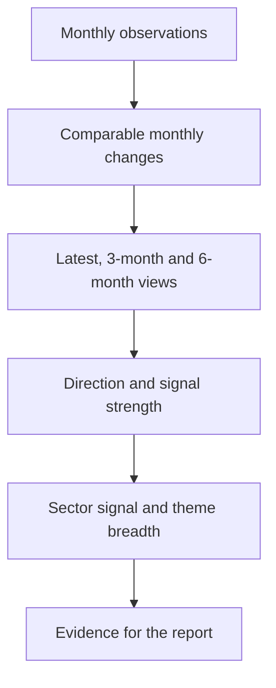

# Understanding the report metrics

This guide explains the ideas behind the deterministic metric layer in **AI UK
Macro Reporting**. Its purpose is to help readers understand how monthly data
is turned into evidence for the report without requiring a background in
economics or statistics.

The metrics do not decide whether the UK economy is "good" or "bad", and they
do not produce forecasts by themselves. They organize noisy indicators into a
consistent set of questions:

- Which way is an indicator moving?
- Is the latest movement unusually large?
- Has that movement continued for several months?
- Do short- and medium-term views tell the same story?
- Is the pattern visible across several related indicators?

These questions correspond to **direction**, **magnitude**, **persistence**,
**consistency**, and **breadth**. Together they form an indicator's **signal**.

## From observations to report evidence



The calculation layer runs before the LLM analysis. It therefore gives the
report a deterministic numerical foundation: the same input data and settings
produce the same metrics.

## First, make each series interpretable

Economic indicators arrive in different forms. GDP and retail-sales indices
are levels, inflation and interest rates are percentages, and lending series
may be monthly flows in millions of pounds. Comparing their raw values would
not be meaningful.

The project first converts each series into a monthly signal measure using its
configured transformation:

| Input type | Transformation | Example interpretation |
| --- | --- | --- |
| Already-calculated monthly growth or inflation rate | Use as reported | Output grew by 0.4% in the observation month. |
| Index, count, or level | Percentage change | Output increased by 0.4% from the previous observation. |
| Rate or monthly flow | Difference | Inflation decreased by 0.2 percentage points, or lending increased by £100 million. |

Some series are then sign-reversed so that indicators within a theme point in
a consistent analytical direction. For example, falling unemployment is
treated as a positive labour-market movement, while faster money growth is
treated as a negative movement in a theme where positive means tighter
monetary conditions.

### Positive does not mean desirable

The labels `positive`, `negative`, and `neutral` describe the configured
direction of movement. They are not value judgements.

| Theme | A positive signal means |
| --- | --- |
| Output and demand | Stronger economic activity or demand |
| Inflation | Greater inflation pressure |
| Labour market | Firmer employment conditions, labour demand, or wage pressure |
| Monetary policy | Tighter monetary or financial conditions |

For example, positive inflation pressure may be economically undesirable, and
positive monetary conditions mean tightening rather than improved conditions.
Direction should always be read together with the theme.

## The basic time-based metrics

For each indicator, the project calculates four numerical summaries.

| Metric | Calculation | Intuitive meaning |
| --- | --- | --- |
| `latest_signal_change` | Most recent transformed monthly change | What happened most recently? |
| `three_month_momentum` | Mean of the latest three transformed changes | What is the recent underlying direction? |
| `six_month_trend` | Mean of the latest six transformed changes | Is the medium-term pattern pointing the same way? |
| `twelve_month_volatility` | Standard deviation of the latest twelve transformed changes | How variable has this indicator normally been? |

The three-month momentum is used as the indicator's main direction because it
reduces the influence of a single noisy month while remaining responsive to a
change in economic conditions. The latest change and six-month trend remain
important because they show whether the newest observation and the broader
pattern agree with that direction.

## Volatility adjustment

A monthly movement that is large for Bank Rate may be ordinary for a volatile
lending series. The project therefore evaluates a change relative to the
indicator's own recent volatility:

```text
volatility-adjusted movement = change / twelve-month volatility
```

This expresses the movement in units of the series' recent variability. It is
not a conventional mean-centred statistical z-score; the project divides the
change by volatility but does not subtract a historical mean.

Volatility adjustment helps compare the importance of movements across very
different indicators. It asks, "Is this change meaningful for this particular
series?" rather than, "Is its raw number larger than another series?"

## Signal

A **signal** is the compact interpretation derived from an indicator's recent
movements. It has two separate parts:

- **Direction**: positive, negative, or neutral.
- **Strength**: weak, moderate, or strong.

Keeping these separate matters. A negative signal can be strong: this means
there is substantial evidence of movement in the negative configured
direction, not that the evidence is poor.

The signal strength is based on three complementary tests:

| Component | Question answered |
| --- | --- |
| Magnitude | Is the newest movement unusually large? |
| Persistence | Has the same direction appeared repeatedly in recent months? |
| Consistency | Do the latest, three-month, and six-month views agree? |

## Direction

**Direction** describes where the indicator's recent momentum is pointing.
The project divides the three-month momentum by twelve-month volatility and
uses the following rules:

| Volatility-adjusted three-month momentum | Direction |
| --- | --- |
| Greater than `0.5` | Positive |
| Less than `-0.5` | Negative |
| Between `-0.5` and `0.5`, inclusive | Neutral |

The neutral range prevents small movements from being presented as meaningful
directional evidence. It is particularly useful with monthly economic data,
where small changes may reflect sampling variation, timing effects, or later
revisions.

## Magnitude

**Magnitude** measures how unusual the latest monthly movement is relative to
the indicator's twelve-month volatility. The sign is ignored for this test;
large positive and large negative movements are equally important evidence.

| Absolute volatility-adjusted latest change | Magnitude score |
| --- | --- |
| Below `0.75` | 0 |
| `0.75` to below `1.5` | 1 |
| `1.5` or greater | 2 |

Magnitude helps identify shocks and turning points. However, a large movement
can be temporary, so it is not treated as sufficient evidence on its own.

## Persistence

**Persistence** asks whether the most recent monthly changes repeatedly support
the three-month momentum direction.

| Matching months among the latest three | Persistence score |
| --- | --- |
| All three | 2 |
| Two | 1 |
| Fewer than two, or neutral momentum | 0 |

Persistence helps distinguish an emerging pattern from a one-month jump. For
example, three consecutive months of easing inflation pressure provide a more
durable signal than one sharp fall following two increases.

## Consistency

**Consistency** compares three different views of the same indicator:

1. the latest monthly change;
2. three-month momentum;
3. the six-month trend.

| Agreement across the three views | Consistency score |
| --- | --- |
| All three are positive, or all three are negative | 2 |
| At least two share the same non-neutral direction | 1 |
| No positive or negative majority | 0 |

Consistency is different from persistence. Persistence looks across the latest
three individual months; consistency checks whether different time horizons
support the same interpretation. A series can be persistent recently but
inconsistent with its six-month trend, which may indicate a turning point.

## Signal score and strength

The three component scores are added:

```text
signal score = magnitude + persistence + consistency
```

The result ranges from 0 to 6.

| Signal score | Signal strength |
| --- | --- |
| 0–1 | Weak |
| 2–4 | Moderate |
| 5–6 | Strong |

This design avoids equating one dramatic observation with a strong underlying
economic signal. A strong signal normally needs support from more than one
dimension—for example, a meaningful movement that persists and agrees across
time horizons.

### Illustrative example

Suppose an indicator has:

- a latest movement equal to `1.2` times its recent volatility;
- positive three-month momentum;
- two of the latest three monthly directions matching that momentum;
- positive latest, three-month, and six-month directions.

Its scores would be:

| Component | Score | Reason |
| --- | ---: | --- |
| Magnitude | 1 | `1.2` is between `0.75` and `1.5`. |
| Persistence | 1 | Two of the latest three months match. |
| Consistency | 2 | All three time views are positive. |
| **Total** | **4** | Classified as a **moderate positive signal**. |

This is a synthetic example intended only to explain the calculation.

## Breadth

**Breadth** asks how widely a direction is shared across selected indicators
within an economic theme. It is a cross-sectional measure: instead of asking
whether one series is moving, it asks how many related series are moving in a
similar direction.

The project counts positive, negative, and neutral directions among a
predefined set of representative breadth components. A classification is
assigned when one direction accounts for at least two thirds of the available
components:

| Share of selected components | Breadth classification |
| --- | --- |
| At least two thirds positive | Broad positive |
| At least two thirds negative | Broad negative |
| At least two thirds neutral | Broadly stable |
| No direction reaches two thirds | Mixed |
| No components are available | Insufficient data |

When no configured breadth component has enough usable observations, the
runtime still returns an `overall_breadth` object. Its `classification` is
`insufficient_data`, and its positive, negative, and neutral counts are all
zero. No directional breadth is inferred from the missing components.

For example, if four of five selected inflation indicators show positive
directions, inflation pressure is classified as broad positive. If the
indicators are split between positive, negative, and neutral, the result is
mixed even if one prominent series moved sharply.

Only configured breadth components are counted. This avoids automatically
giving greater influence to a theme simply because it contains more or highly
similar series.

## Sector-level overall signals

Related indicators are also combined into sector summaries, such as output,
household demand, wage pressure, or market rates.

For direction, each indicator receives a signed value:

```text
positive = +1, neutral = 0, negative = -1
```

That value is multiplied by the indicator's signal score, and the signed scores
are averaged. Therefore, a strong directional signal contributes more than a
weak one.

| Average signed score | Sector direction |
| --- | --- |
| Greater than `0.5` | Positive |
| Less than `-0.5` | Negative |
| Between `-0.5` and `0.5`, inclusive | Neutral |

Sector strength is based on the average unsigned signal score:

| Average signal score | Sector strength |
| --- | --- |
| Below `2` | Weak |
| `2` to below `4` | Moderate |
| `4` or greater | Strong |

Direction and strength again answer different questions: where is the sector
moving, and how convincing is the combined evidence?

## Why these metrics help evaluate the UK economy

No single indicator gives a complete account of the economy. Monthly GDP may
be revised; retail sales can be affected by weather; wage data may lag turning
points; and headline inflation can move because of a narrow group of volatile
prices. The metric framework helps the report use these data more carefully.

- **Direction** identifies the recent economic orientation without overreacting
  to very small movements.
- **Magnitude** highlights observations that are unusual for the series.
- **Persistence** distinguishes repeated movement from a temporary fluctuation.
- **Consistency** reveals whether short- and medium-term evidence agrees or may
  be signalling a transition.
- **Breadth** shows whether a development is widespread or concentrated in a
  few indicators.
- **Strength** provides a compact measure of how much support sits behind a
  positive or negative interpretation.

Used together, the measures support richer statements. Instead of saying only
"inflation fell," the report can distinguish between a large but isolated fall,
a persistent decline across several months, and broad easing across consumer
prices, producer prices, and expectations. Likewise, it can separate weakness
in one output industry from a broad loss of economic momentum.

These deterministic metrics are passed to the thematic and cross-theme stages
of the report. The LLM explains relationships and qualifications in natural
language, while the calculated direction, strength, and breadth provide an
auditable evidence base.

## Interpretation cautions

- The thresholds are modelling choices, not universal economic laws. They can
  be reviewed as the project is tested against more reporting periods.
- Direction labels have theme-specific meanings and should not be read as
  welfare judgements or investment recommendations.
- Volatility adjustment depends on sufficient recent history. When volatility
  is missing, non-finite, or not positive, the current implementation uses zero
  as the standardized value, producing a neutral and generally weak signal.
- The calculations use the observations supplied to the graph. They do not
  independently verify data sources, seasonal adjustment, revisions, or release
  timing.
- Breadth is based on selected representative components rather than every
  configured indicator.
- The metrics describe historical data. Scenarios and outlook statements remain
  conditional interpretations that require human review.

For the supported indicators and their transformations, see the
[Indicator guide](indicators.md). For the required input format and recommended
history, see the [Input data specification](input-data.md).
